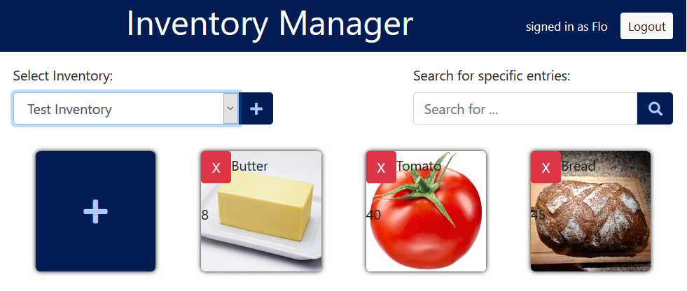
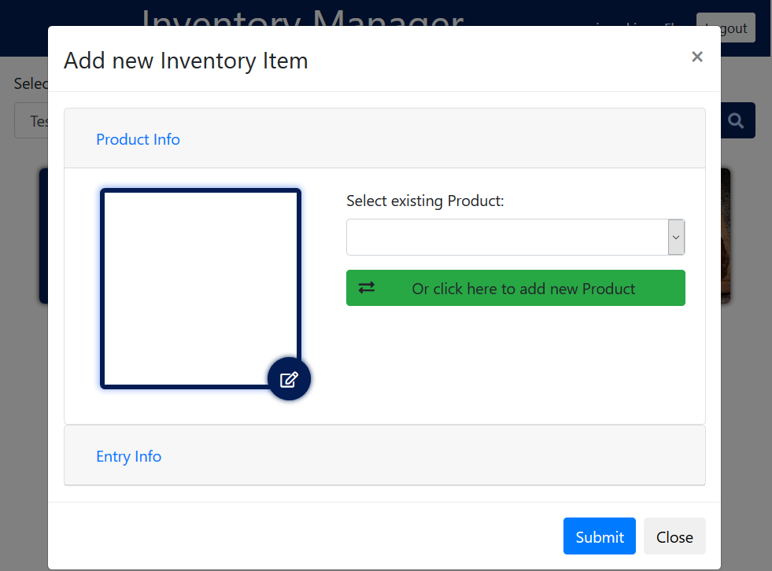
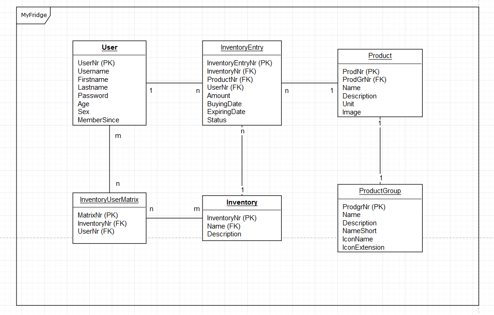

# InventoryManager

This project was created completely with PHP in collaboration with my french friend and study college [Jix](https://github.com/JixPOYLO).

# Project environment

It was implemented for a PHP/Database course at the Laurea University of Applied Science. It was a final project to show what we learned in this course.

# The Project - MyFridge

Often you're standing at the grocery store beeing unsure if you're having a specific ingredient in your refridgerator or not. With **MyFridge** you can keep track of your inventory with your mobile or desktop device. One thing less to worry about!

You can:

- add/delete/update ingredients
- upload your own pictures of the things you want to keep track of
- reuse previously added ingredients
- register/login/lout
- search for items
- add/delete/switch between inventories

Inventory overview:

Adding new Inventory items:

Database UML Diagramm:

